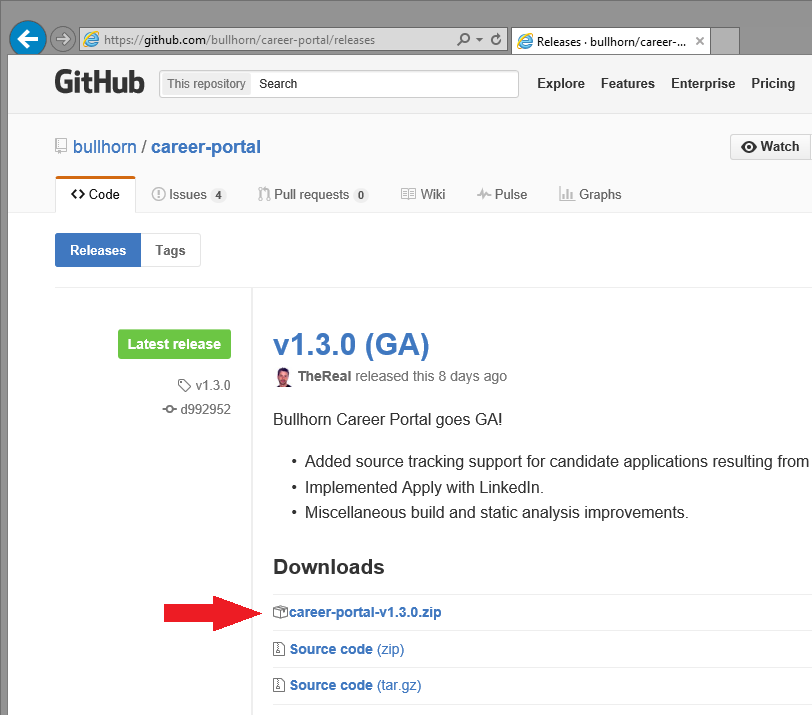

The first step in the deployment process is to download and configure a Bullhorn Career Portal release package, as described below.  The steps provided are for linux platforms, but can be replicated on a Windows server:

Prerequisites, ensure you have Node.js and **[PM2](http://pm2.keymetrics.io/)** installed.

***

**1. Download the latest release of Bullhorn Career Portal**

The latest stable version of Bullhorn Career Portal can be found  **[Here](https://github.com/bullhorn/career-portal/releases/latest)**.

The `Release Page` will display. Right click and copy the url for the `career-portal-v[x.y.z]-dynamic.zip` link and download it to your machine with wget
```wget https://github.com/bullhorn/career-portal/releases/download/v[x.y.z]/career-portal-v[x.y.z]-dynamic.zip ```


***

**2. Extract Bullhorn Career Portal files from the Zip Archive**

Now, unzip your file to the directory of your choice, this will the be the directory that you are running the application from.   

```unzip career-portal-v[x.y.z]-dynamic.zip```


***

**3. Configure settings in the application configuration file**

Navigate to the extracted folder and open the `app.json` file up in a text editor such as vim.


Locate and update the following values:
* `[ COMPANY NAME HERE ]` - A string representing the name of your company, or another identifier which will appear in the masthead of  list and card view.*
* `[ CORP TOKEN HERE ]` - A string which identifies your company when accessing the Bullhorn REST API. This information can be provided by a Bullhorn Customer Specialist.*
* `[ SWIMLANE HERE ]` - A quoted number which identifies the production environment for your company's ATS/CRM instance. This information can be provided by a Bullhorn Customer Specialist.*

*_This information must be obtained from Bullhorn Customer Support by creating a support ticket using the Bullhorn Resource Center. To create a support ticket, log into Bullhorn and navigate to Menu --> Support --> Bullhorn Resource Center._

Your Bullhorn Career Portal automatically identifies the locale for the user and translates the content on the career portal to match.  If the user has multiple locales set in their browser, the locale chosen will be the first available option under `supportedLocales`.  If none of the user's locales match, it will fall back to the option under `defaultLocale`.  The following locales are available by default:

* en-US - English (United States)
* en-GB - English (United Kingdom)
* fr-FR - French (France)

If you require support for a locale not listed here, please submit a **[GitHub issue](https://github.com/bullhorn/career-portal/issues)**.

**Voluntary EEOC/OFCCP data collection**

With the v2.0.0 release, you can elect to solicit self-identification data from your candidates by setting various EEOC parameters ("genderRaceEthnicity," "veteran," "disability") to TRUE in the app.json file. If displayed, these fields will be required, but the respondent can select "I choose not to self identify." 

### Check your app.json file

Once configured, your app.json file will look similar to the following. Please note that the brackets in the default file should be removed where you have added values for `corpToken,` `swimlane,` and `clientId.` For additional information about the configuration of the app.json file please see our [wiki article on the configuration options available.](/portal-configuration-options.md). 


Save the file.

***

**4. Start the Server**

First, set the port that you would like the app to run 

Using PM2, navigate to the `server` sub directory, then set the port that you would like the app to be accessible from with ```export PORT=PORTNUMBER```.  Once that has been done run ```pm2 start server.js```


***

** Thats It!** You are able to access the app at `http://localhost:PORT`.  The default port if a port was not chosen is 4000.


