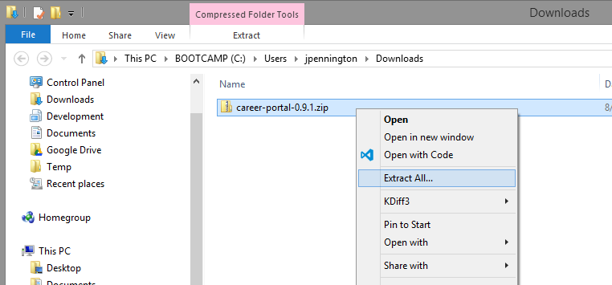
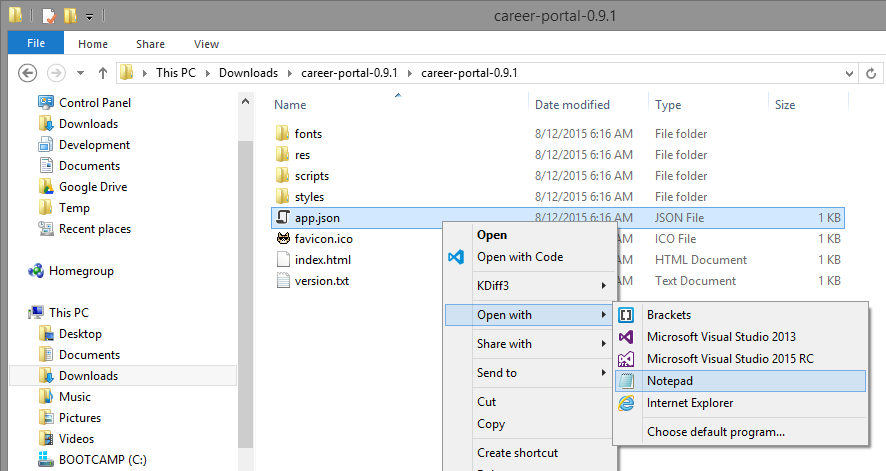
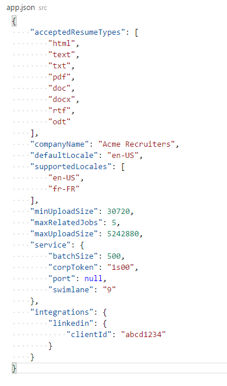
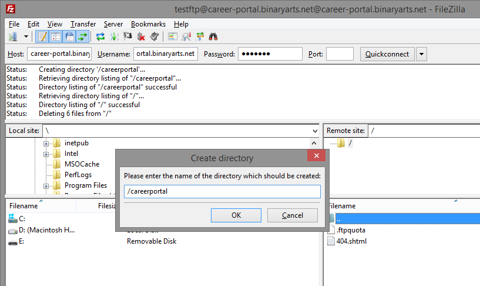
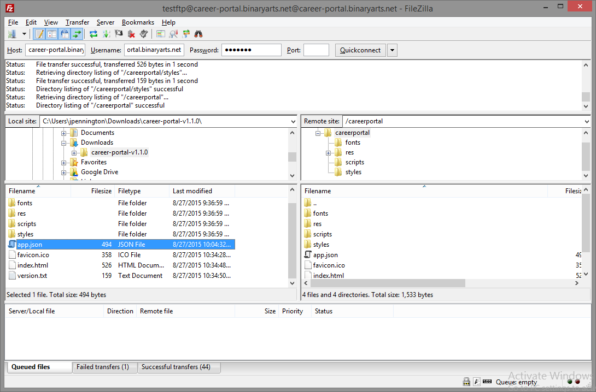

The first step in the deployment process is to download and configure a Bullhorn Career Portal release package, as described below:

***

**1. Download the latest release of Bullhorn Career Portal**

The latest stable version of Bullhorn Career Portal can be found  **[Here](https://github.com/bullhorn/career-portal/releases/latest)**.

The `Release Page` will display. Click the `career-portal-v[x.y.z].zip` link and your browser will download and save a Zip archive onto your hard drive. Make note of where the archive was saved:

***

**2. Extract Bullhorn Career Portal files from the Zip Archive**

Locate the downloaded Zip Archive from step (1) in Windows File Explorer or other file system viewer. Extract its contents to the same location on your hard drive. On Microsoft Windows, this can be done by right-clicking on the saved Zip file and selecting `Extract All...` from the context menu:

***

**3. Configure settings in the application configuration file**

Navigate to the extracted folder and open the `app.json` file up in a text editor such as Microsoft Notepad:

 The file contents will look like this:

Locate and update the following values:
* `[ COMPANY NAME HERE ]` - A string representing the name of your company, or another identifier which will appear in the masthead of  list and card view.*
* `[ CORP TOKEN HERE ]` - A string which identifies your company when accessing the Bullhorn REST API. This information can be provided by a Bullhorn Customer Specialist.*
* `[ SWIMLANE HERE ]` - A quoted number which identifies the production environment for your company's ATS/CRM instance. This information can be provided by a Bullhorn Customer Specialist.*

*_This information must be obtained from Bullhorn Customer Support by creating a support ticket using the Bullhorn Resource Center. To create a support ticket, log into Bullhorn and navigate to Menu --> Support --> Bullhorn Resource Center._

Your Bullhorn Career Portal automatically identifies the locale for the user and translates the content on the career portal to match.  If the user has multiple locales set in their browser, the locale chosen will be the first available option under `supportedLocales`.  If none of the user's locales match, it will fall back to the option under `defaultLocale`.  The following locales are available by default:

* `en-US` - English (United States)
* `en-GB` - English (United Kingdom)
* `fr-FR` - French (France)

If you require support for a locale not listed here, please submit a **[GitHub issue](https://github.com/bullhorn/career-portal/issues)**.

**Voluntary EEOC/OFCCP data collection**

With the v2.0.0 release, you can elect to solicit self-identification data from your candidates by setting various EEOC parameters ("genderRaceEthnicity," "veteran," "disability") to TRUE in the app.json file. If displayed, these fields will be required, but the respondent can select "I choose not to self identify." 

### Check your app.json file

Once configured, your app.json file will look similar to the following. Please note that the brackets in the default file should be removed where you have added values for `corpToken,` `swimlane,` and `clientId.` For additional information about the configuration of the app.json file please see our [wiki article on the configuration options available.](/portal-configuration-options.md). 

Save the file.

***

**4. Upload to Site Host**

The details of this step are particular to the service hosting your website, but the general process is the same connect to an FTP endpoint provided by the the site host and upload files downloaded and configured in previous steps.

A vast majority of website hosts support uploading site content via FTP. You will need FTP login information from your website host. The location of this information is dependent on your specific provider, but most display the information in your site account management area. Log into your hosting account and search for "FTP Details" or similar in the provider's search function or support documentation. You will need an `FTP Hostname`, `FTP Username` and `FTP Password`, and optionally an `FTP Port`.

***

**5. Download and Install an FTP Client**

An FTP Client is software designed to transfer files back and forth between two computers over the internet. It needs to be installed on your computer and can only be used with a live connection to the internet. With an FTP client file transfers are made by simply dragging and dropping files from one pane to the other.

**[FileZilla](https://filezilla-project.org)** is a popular and free FTP client. Download, install and launch **[FileZilla](https://filezilla-project.org)** or your preferred FTP client.

***

**6. Connect to your Website Host**

In your FTP client, choose `New Connection` or a similar command from the application menu or list of command buttons. In **FileZilla**, you can open a new connection using the `Quickconnect` command button directly on the FTP interface. Provide the `FTP Hostname`, `FTP Username` and `FTP Password` when connecting. Provide the `FTP Port` or a default value of `21` if prompted, and click the `Connect` button or similar:

***

**7. Create a Directory to Host Bullhorn Career Portal Content**

Typically a website host locates all site content in a `www`, `wwwroot`, `htmlroot` or similar folder; refer to your provider for specific details. Using your FTP Client, open the site content directory of the remote site and create a directory named `careerportal` or similar:

The directory will will act as the root path to the Bullhorn Career Portal. For example, if your site is `www.example.com`, creating a directory `careerportal` would result in the Bullhorn Career Portal being hosted at `www.example.com/careerportal`.

***

**8. Upload Bullhorn Career Portal package to the FTP Directory**

Navigate to the newly created directory in the `Remote Site` or similar panel in your FTP client. Navigate to the location of your extracted and configured Bullhorn Career Portal package from the `Download and Configure` step in the `Local Site` or similar panel in your FTP client. Drag and drop each directory and file from the `Local Site` or similar panel to the `Remote Site` or similar panel in your FTP client.

When the transfer is complete, your remote directory should appear identical to your local directory:

***

**9. Test your Bullhorn Career Portal**

Navigate to your website in a browser, paying careful attention to ensure that the Bullhorn Career Portal FTP root directory is included in the URL; for example,`http://www.example.com/careerportal`. Verify the portal is displaying jobs published via the Bullhorn ATS/CRM JobCast screen.

***

**That's it!** Your configured Bullhorn Career Portal is uploaded and ready for use!

### Other Options for Installing the portal statically

* **[General File Upload via Site Host Control Panel](/Uploading-via-Site-Host-Control-Panel.md)**
* **[Amazon AWS S3](/Uploading-to-Amazon-AWS-S3.md)**

