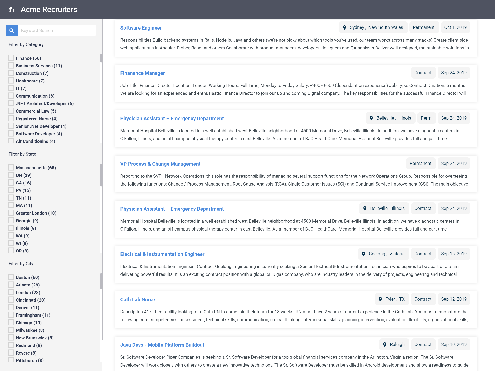

# Bridging the gap between applicants and opportunities

  

**[Bullhorn Career Portal](http://www.bullhorn.com)** is the next-generation way to share jobs and source candidates from your Bullhorn ATS/CRM instance. Download, configure and host your own career portal, or fork the source code and make it your own.



## Features

The Bullhorn Career Portal is open source and extremely simple to [customize](/customizing.md), but includes several out of the box features that allows you to change what data is displayed on your jobs.  

### Using Basic Static Host

- [Google Analytics to track your candidates' actions.](/google-analytics-details.md)
- Extremely simple apply form that can be filled out in less than 30 seconds
- Directly integrates with Bullhorn
- [Easily update what fields display on your jobs](/job-details.md)

### Using Advanced hosting

- Renders your site server side to save on processing on your candidate's computer
- [Generates jsonld metadata for use with Google and other search engines](/search-engine-indexing.md)
- Enables richer job sharing on social media.
- Generates an XML sitemap in addition to an XML feed for use with external job aggregate sites

## Configuring & Deploying

  

### Installing 
When installing the career portal you have two options, each with their own requirements.

 1. [Advanced](/advanced-install.md)
	 - Enables SEO features
 3. [Basic](/basic-install.md) (Direct Upgrade from Previous Versions)
 4. [Wordpress Plugin](/Using-the-Bullhorn-Career-Portal-on-Wordpress.md)
  

## Building for local development

  

In order to build Bullhorn Career Portal, ensure that you have **[Git](http://git-scm.com/downloads)**, **[Node.js](http://nodejs.org)**, and **[Angular CLI](https://angular.io/guide/setup-local#step-1-install-the-angular-cli)** installed.

  

Clone a copy of the repo:

  

```
git clone https://github.com/bullhorn/career-portal.git
```

  

Change to the Career Portal directory:

  

```
cd career-portal
```

  

Install build tools and dev dependencies:

  

```
npm install
```

  

Use one of the following to build and test:  

```
npm run serve           # Launch a local version of the career portal (frontend only).
npm start               # Launch a local server with server side rendering portal.
npm run build:static    # Build an optimized version of Career Portal in `/dist`
npm run build           # Build a package for use with server side rendering=
```

  
  
  

## Runtime vs. Buildtime Configurations

  

To maximize the flexibility of application configuration, all configuration-level integrations should derive their

dynamic variables from the app.json file. That file can then be loaded into the application.

  

## Helpful Utilities

  

* **[NPM-Check-Updates](https://github.com/tjunnone/npm-check-updates)** - checks for updates of node modules with CLI
